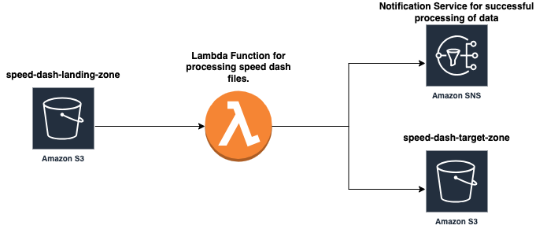

# Speed-Dash-Data-Pipeline
This project involves creating an automated AWS-based solution for processing daily delivery data from hypothetical company called SpeedDash.

## Motivation behind this Project:
Whenever we think  about Data Engineering projects/Data pipelines, we imagine every complex scenarios, whereas we neglect the simple approaches on which we can build our ideas. This DE project is about keeping it simple. I have worked on similar simple projects in my job.

This project involves creating an automated AWS-based solution for processing daily
delivery data from SpeedDash. JSON files containing delivery records will be uploaded to an
Amazon S3 bucket. An AWS Lambda function, triggered by the file upload, will filter the
records based on delivery status and save the filtered data to another S3 bucket.
Notifications regarding the processing outcome will be sent via Amazon SNS

### A brief description about AWS services that have been used in this project
1. S3: Amazon S3 (Simple Storage Service) is one of the foundational services in the AWS suite and is widely used by businesses and
individuals to store and retrieve any amount of data, at any time, from anywhere.
[Official Page](https://docs.aws.amazon.com/AmazonS3/latest/userguide/Welcome.html)

2. AWS Lambda: AWS Lambda is a serverless computing service that lets you run code without provisioning or managing servers. It automatically
scales your application by running code in response to events, such as changes to data in Amazon S3 buckets or updates in an
Amazon DynamoDB table.
[Official Page](https://docs.aws.amazon.com/lambda/latest/dg/welcome.html)

3. SNS: Amazon Simple Notification Service (Amazon SNS) is a fully managed messaging service provided by AWS. It is designed for
distributing notifications to a wide range of recipients. With SNS, you can send messages to individual recipients or to large
numbers of recipients.
[Official Page](https://docs.aws.amazon.com/sns/latest/dg/welcome.html)

4. CodeBuild: AWS CodeBuild is a fully managed build service in the cloud. CodeBuild compiles your source code, runs unit tests, and produces artifacts that are ready to deploy. CodeBuild eliminates the need to provision, manage, and scale your own build servers.
[Official Page](https://docs.aws.amazon.com/codebuild/latest/userguide/welcome.html)

**Requirements**:
- AWS Account
- Amazon S3 buckets: speed-dash-landing-zone and speed-dash-target-zone
- AWS Lambda
- Amazon SNS
- AWS IAM (for permissions)
- AWS CodeBuild (for CI/CD)
- GitHub (for version control)
- Python, pandas library
- Email subscription for SNS notifications

Steps:
1. Sample JSON File for Daily Data:
    - A sample JSON file named 2024-03-09-raw_input.json with 10 delivery records, including different statuses like cancelled, delivered, and order placed.
    - Daily JSON will arrive in S3 bucket speed-dash-landing-zone with format like yyyy-mm-dd-raw_input.json
    - You can see/download the sample json file [Here](2024-03-09-raw_input.json)

2. As soon as file lands in S3, data processing should start
    - Set Up S3 Buckets: Create two S3 buckets: speed-dash-landing-zone for incoming raw files and speed-dash-target-zone for processed files.
3. Set Up Amazon SNS Topic:
    - Create an SNS topic for sending processing notifications.
    - Subscribe an email to the topic for receiving notifications.
4. Create IAM Role for Lambda:
    [!IMPORTANT]
    - Create an IAM role with permissions to read from speed-dash-landing-zone, write to speed-dash-target-zone, and publish messages to the SNS topic.
5. Create and Configure AWS Lambda Function:
    - Create a Lambda function using Python runtime.
    - Add the pandas library to the function's deployment package or use a Lambda Layer for pandas.
    - Use the S3 trigger to invoke the function upon file uploads to speed-dash-landing-zone.
    - The Lambda function should:
        - Read the JSON file into a pandas DataFrame.
        - Filter records where status is "delivered".
        - Write the filtered DataFrame to a new JSON file in speed-dash-target-zone using the specified format.
        - Publish a success or failure message to the SNS topic.
6. AWS CodeBuild for CI/CD:
    - Host your Lambda function code on GitHub.
    - Set up an AWS CodeBuild project linked to your GitHub repository.
    - Configure the [buildspec.yml](buildspec.yml) to automate deployment of your Lambda function code updates.

7. Testing and Verification:
    - Upload the sample JSON file to speedd-dash-landing-zone and verify that the Lambda function triggers correctly.
    - Check speed-dash-target-zone for the processed file and confirm its contents.
    - Ensure an email notification is received upon processing completion.

## Architecture Diagram

